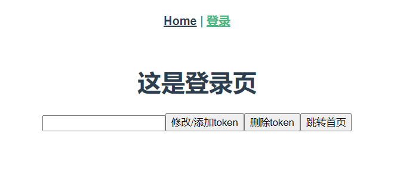
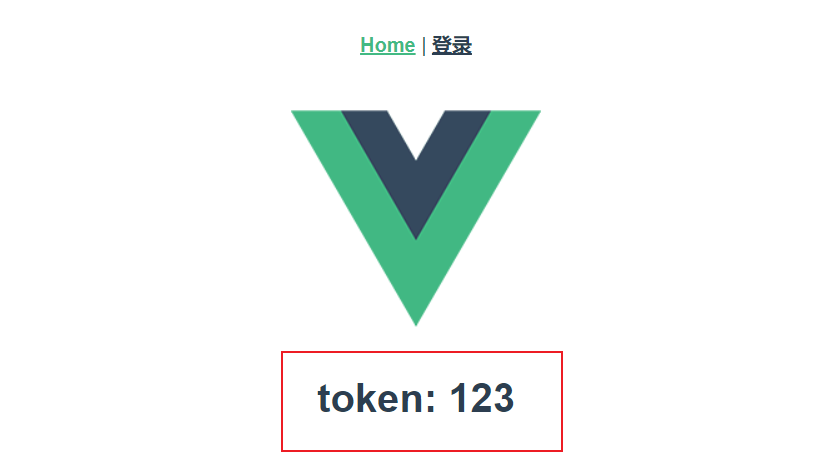

# vuex-localstorage

## Project setup
```
npm install
```

### Compiles and hot-reloads for development
```
npm run serve
```

该项目为在设置路由守卫，除了登录页面，其他页面在没有登录获取token时无法访问页面

路由配置

```javascript
import Vue from 'vue'
import VueRouter from 'vue-router'
import Home from '../views/Home.vue'
import store from '../store/index'

Vue.use(VueRouter)

const routes = [
  {
    path: "/",
    redirect: "/home"
  },
  {
    path: '/home',
    name: 'Home',
    component: Home,
    meta: {
      requireAuth: true
    }
  },
  {
    path: '/login',
    name: 'Login',
    component: () => import('../views/Login.vue')
  }
]

const router = new VueRouter({
  mode: 'history',
  base: process.env.BASE_URL,
  routes
})

//路由前卫
router.beforeEach((to, from, next) => {
	// 判断该路由是否需要登录权限
  if (to.meta.requireAuth) { 
      // 通过vuex state获取当前的token是否存在
      if (store.state.token) {  
          next();
      }
      else {
          // 将跳转的路由path作为参数，登录成功后跳转到该路由
          next({
              path: '/login',
              query: {redirect: to.fullPath}  
          })
      }
  }
  else {
      next();
  }
})

export default router
```

vuex配置

```javascript
import Vue from 'vue'
import Vuex from 'vuex'

Vue.use(Vuex)

let store =  new Vuex.Store({
  state: {
    token: ''
  },
  mutations: {
    setToken(state, token) {
      localStorage.setItem('token1', token);
      state.token = token;
    },
    delToken(state) {
      localStorage.removeItem('token1');
      state.token = '';
    }
  },
  actions: {
  },
  modules: {
  }
})

// 路由判断之前读取localStorage里的状态信息
if (localStorage.getItem("token1")) {
  let token1 = localStorage.getItem("token1");
  store.commit("setToken", token1);
}

export default store;

```



